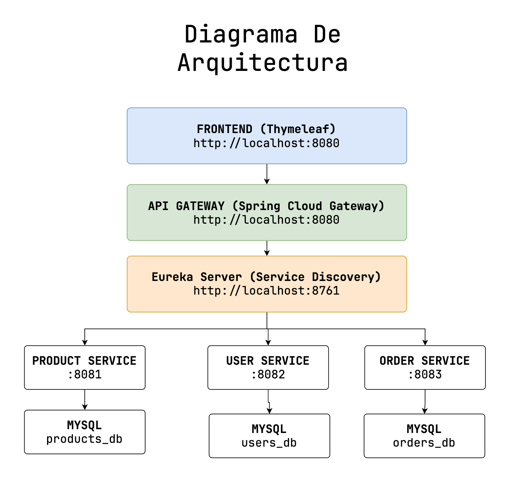

# Ecommerce implementación completa

## Objetivo principal

Desarrollar un sistema de ecommerce completo (2-3 entidades) utilizando **Spring Framework** con arquitectura de microservicios, aplicando todos los conceptos teóricos en un proyecto funcional y profesional.

## Tecnologias

- Java 17 LTS
- Maven
- Spring Framework + Spring Initializr
- MySQL - Base de datos relacional
- Lombok - reducción de código
- Spring Boot - Configuración automática y productividad

## Conceptos Aplicados

- Spring Core: inyeccion de dependencias, ambitos, ciclo de via, AOP
- Spring MVC: Data binding, thymeleaf, subida de archivos
- Spring Data: DSL, JPQL, consultas, transacciones, relaciones
- Spring Boot: DevTools, validaciones, logging, actuator
- Microservicios: Comunicación, patrones, REST, Eureka, Kafka
- Spring Security: Autenticación, autorización, JWT

## Arquitectura del sistema

### Diagrama de arquitectura



### Estructura del proyecto

```plain
.
└── ecommerce-microservices/
    ├── eureka-server/
    ├── api-gateway/
    ├── product-service/
    ├── user-service/
    ├── order-service/
    ├── frontend-service/
    └── pom.xml(parent)
```
